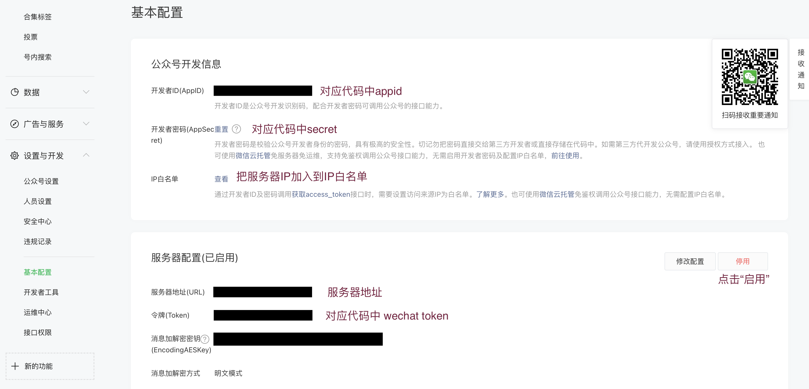
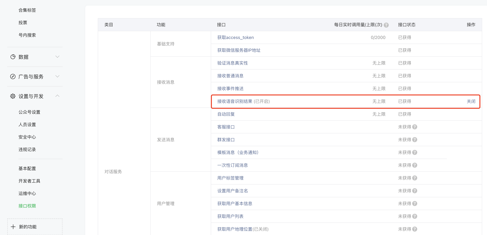

# 简介

本项目用于构建多功能AI聊天机器人，支持输入语音、文字，输出生成、标记的对应图文。
支持多种类多模态模型进行快捷替换，包括：文本生成，图片/视频生成，图片/视频分割等模型，
用户可以通过文件配置的方式灵活切换使用模型和应用场景。

未来计划对不同模型进行使用、评测及对比。
+ `文本生成`: 以中文为主，主要包括chatgpt及其平替，如：ChatGLM、Chinese-ChatLLaMA、Phoenix、Chinese-alpaca-lora等模型；
+ `图片/视频生成`: 主要包括：Stable Diffusion、DALL E-2、Stable-Dreamfusion等模型；
+ `文本生成`: 主要包括：SAM、Grounded Segment Anything等模型。


**文本模型：**

 - [x] ChatGPT (gpt-3.5)
 - [ ] ChatGLM

**图片生成模型：**

 - [x] DALL E-2
 - [x] Stable Diffusion
 
**应用：**

 - [x] 微信公众号-个人订阅号
 - [x] 终端
 - [x] Web


# 快速开始

## 一、准备

### 1.运行环境

支持 Linux、MacOS、Windows 系统，需安装 Python 及 requirement.txt 中的包，若使用openai的相关接口（如：chatgpt，DALL E-2），需要在代理的环境下运行。
本项目在Linux进行测试运行，python版本为3.10

克隆项目代码，并安装依赖：

```bash
pip install -r requirement.txt
```
> 或在 Realase 直接手动下载源码。

### 2.运行方法

可以使用 `config.json` 进行模型和应用的选择，以及参数的配置。
若要快速开始，可以使用openai的chatgpt和DELLE-2模型进行对话。
仅需把 `config.json` 中的 `api_key`替换成你自己openai的api key（若无 key 请见下文）

```bash
"api_key":"your openai api key"
```

最后在代理的环境下，运行

```bash
python main.py --app terminal
```

## 二、选择模型

### 1. ChatGPT

默认使用的模型是 `gpt-3.5-turbo`，详情参考[官方文档](https://platform.openai.com/docs/guides/chat)。

#### (1) 注册 OpenAI 账号

前往 [OpenAI注册页面](https://beta.openai.com/signup) 创建账号，参考这篇 [教程](https://www.cnblogs.com/damugua/p/16969508.html) 可以通过虚拟手机号来接收验证码。创建完账号则前往 [API管理页面](https://beta.openai.com/account/api-keys) 创建一个 API Key 并保存下来，后面需要在项目中配置这个key。

> 项目中使用的对话模型是 davinci，计费方式是约每 750 字 (包含请求和回复) 消耗 $0.02，图片生成是每张消耗 $0.016，账号创建有免费的 $18 或 $5 额度，使用完可以更换邮箱重新注册。

#### (2) 安装依赖

```bash
pip3 install --upgrade openai
```
> 注： openai版本需要`0.27.0`以上。如果安装失败可先升级pip，`pip3 install --upgrade pip`


#### (3) 配置项说明

```bash
"chatgpt":
{
    "chat_model":"gpt-3.5-turbo",
    "api_key":"your openai api key"
},
```
 + `api_key`: 填入上面注册账号时创建的 `OpenAI API KEY`
 + `model`: 模型名称，目前支持填入 `gpt-3.5-turbo`, `gpt-4`, `gpt-4-32k` 

### 2.Stable Diffusion

使用 `stable-diffusion-webui` 的代码搭建服务，详情参考[github](https://github.com/AUTOMATIC1111/stable-diffusion-webui)。
建议使用GPU服务器提供服务，本项目中使用Tesla T4（15G）的GPU服务器，生成每张图片的耗时约为25秒。

在配置完 `stable-diffusion-webui` 的环境后，可使用如下命令生成服务，若跨服务器调用此接口，需要开启对外端口
```bash
python webui.py --api --port 8001
```

目前代码里默认提供了一个Stable Diffusion的接口服务，该接口极`不稳定`，因为在调试优化图片生成的代码时会断掉。若要长期使用，请根据上述内容`构建自己的服务`。

## 三、选择应用

### 1.微信公众号（个人订阅号）

需要一台服务器，一个订阅号

#### 1.1 配置`config.json`

```bash
"wechat":
{
    "wechat token":"your token",    # 填写你微信公众号的token
    "access_token interface":"https://api.weixin.qq.com/cgi-bin/token?",
    "grant_type":"client_credential",
    "appid":"your appid",   # 填写你微信公众号的appid
    "secret":"your secret", # 填写你微信公众号的secret
    "up_media interface":"https://api.weixin.qq.com/cgi-bin/media/upload?"
}
```

#### 1.2 运行程序

在项目目录下运行 `python main.py 80`，终端显示如下则表示已成功运行：

```
[INFO][2023-02-16 01:39:53][app.py:12] - [INIT] load config: ...
[INFO][2023-02-16 01:39:53][wechat_mp_channel.py:25] - [WX_Public] Wechat Public account service start!
Bottle v0.12.23 server starting up (using AutoServer())...
Listening on http://127.0.0.1:80/
Hit Ctrl-C to quit.
```

#### 1.3 设置公众号回调地址
订阅号申请方式如下
在 [微信公众平台](https://mp.weixin.qq.com/) 中进入个人订阅号，启用服务器配置：



**服务器地址 (URL) 配置**： 如果在浏览器上通过配置的URL 能够访问到服务器上的Python程序 (默认监听8088端口)，则说明配置有效。由于公众号只能配置 80/443端口，可以修改配置为直接监听 80 端口 (需要sudo权限)，或者使用反向代理进行转发 (如nginx)。 根据官方文档说明，此处填写公网ip或域名均可。

**令牌 (Token) 配置**：需和 `config.json` 配置中的token一致。

如需要开启微信自带的语音转文本功能，需要开启对应接口


详细操作过程参考 [官方文档](https://developers.weixin.qq.com/doc/offiaccount/Getting_Started/Getting_Started_Guide.html)

#### 1.4 使用

用户关注订阅号后，发送消息即可。

> 注：用户发送消息后，微信后台会向配置的URL地址推送，但如果5s内未回复就会断开连接，当前采用的方式是：判断5s无法回复则自动回复一句提示，请用户继续等待。

### 2.命令行终端

配置模板中默认启动的应用即是终端，修改openai的api_key后，直接在项目目录下通过命令行执行 `python main.py` 
便可启动程序。用户通过命令行的输入与对话模型交互，且支持流式响应效果。图片将会保存到目录 `generate/images/` 下

```bash
python main.py --app terminal
```

### 3.Web

**依赖**

```bash
pip3 install PyJWT flask flask_socketio
```

**配置**

```bash
python main.py --app web
```

### 通用配置

+ `clear_memory_commands`: 对话内指令，主动清空前文记忆，字符串数组可自定义指令别名。
  + default: ["#清除记忆"]

## 致谢

我们的作品受到以下作品的启发，包括但不限于

- bot-on-anything: https://github.com/zhayujie/bot-on-anything
- stable-diffusion: https://github.com/AUTOMATIC1111/stable-diffusion-webui

